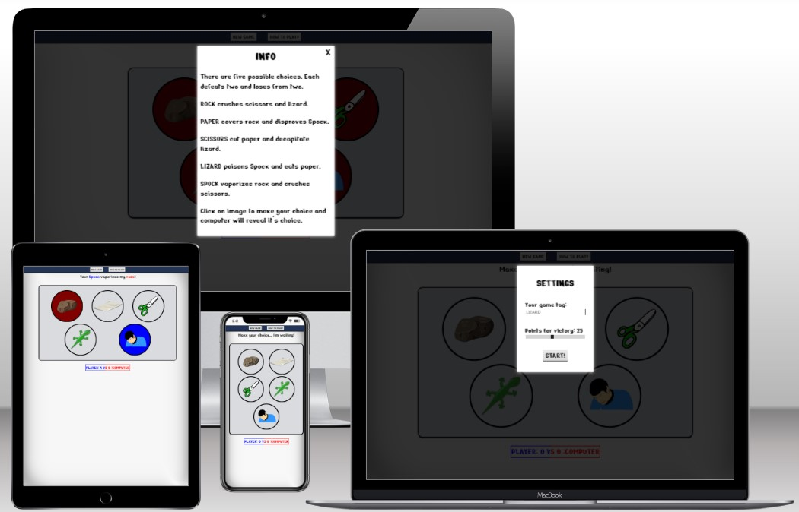
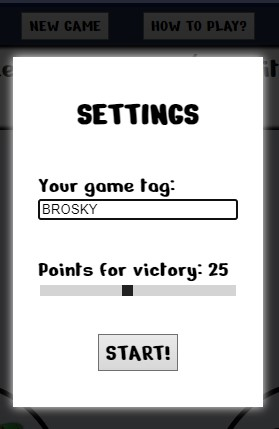
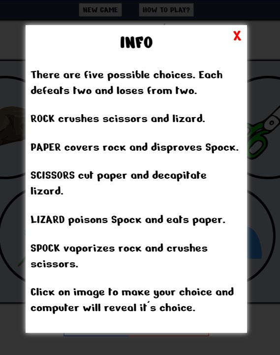
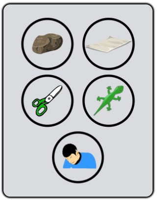
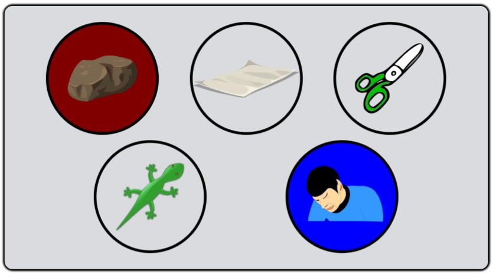
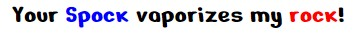
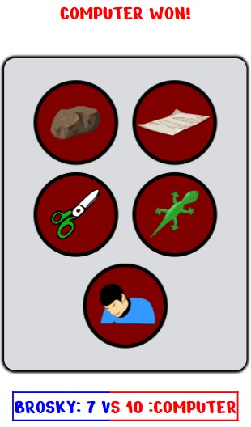
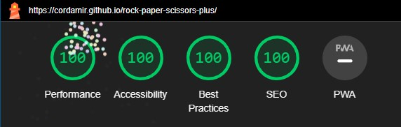
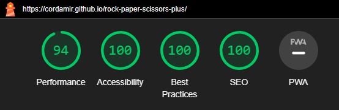

# Rock - Paper - Scissors - Lizard - Spock

Rock - Paper - Scissors - Lizard - Spock is an upgrade to a famous rock - paper - scissors game. Idea comes from a popular sitcom "[The Big Bang Theory](https://www.imdb.com/title/tt0898266/)". Two additional options mean every choice can be beaten by two different choices and it also beats two choices reducing a chance of draw significantly. Playing against a computer provides fun and familiarizes users with five choice interactions so it can be used live later. Beat a rock with Mr. Spock!

 

 ## FEATURES

  ### HEADER

  Simple header with two buttons adds options without feeling of influencing the game space.

  

  ### SETTINGS / GAME START

  On first page load or via header's "NEW GAME" button, a settings menu for a new game pops up. It's displayed as a modal on top of a shaded current game state. White shadow completes attention drawing. User is offered to type their game tag via text input, choose winning point amount via slider and to start a game via start button. Very clear and intuitive

  

  ### INFO
 
  By using header's "HOW TO PLAY?" button user can open a simple clarification of the game. It has the same attention-drawing style as settings and a close button on top right corner which resumes the game exactly as left.

  

  ### GAME AREA AND CHOICE APPEARANCE

  Game itself is played by clicking / touching a circle with a choice image. Options are intuitively clear with representing images. All options are inside an obvious game area distinguished with border and background color. It is completely responsive and works on all screen sizes.

  

  ### INTERACTION FEEDBACK

  ** ANIMATION AND COLOR CODING CHOICES **

  After choosing an option, game will color user and computer choice in blue and red respectively. It will also animate those choises by rotation. A draw will be presented with purple color.

  

  ** GAME MESSAGE **

  For every interaction, a message will be displayed above game area. It contains color-coded user and computer choices, their interaction and result.

  

  ** SCORE KEEPING **

  Below game area there is a score keeping area. It displays user's game tag and score on the left in blue and computer score and text in red on the right. Updated immediately on every choice selection.

  

  ** GAME END SCREEN ** 

  When player or computer get a game-winning point, game message will be fully in their respective color declaring a winner, all choices in game area will animate and change into winner's color and further interaction with game area is disabled.

  

  ### INTUITION AND RESPONSIVENESS

  Header is simple with only two clear options. Settings and info are extremely easy to grasp. Game area is very easy to use, messages are clear and score keeping is obvious. Together this makes a truly intuitive design and a game that can be learned and played even without instructions in seconds. It is entirely responsive and works well on all screen sizes.

  ### FUTURE FEATURES

  - add player vs player capability
  - add an algorithm to computer play that analyses user input and chooses accordingly - implement it as hard mode in options

 

## BUGS

  ### FIXED DURING TESTING

  | PROBLEM | FIX |
  | - | - | 
  | error: undefined alert instead of a message for some interactions | correct spelling for lizard variable (I typed 'lizzard')   |
  | score doesn't update correctly beyond 10 | create a span structure for score display and edit appropriate span.innerText |
  | 'choice not declared' error from JSHint  | declare choice variable: for(choice of choices) - > for(let choice of choices) |
  | animation doesn't work after first time | reason: considered already animated / fix: add animation reversing function which brings element to original state |
  | animations acting inconsistently when playing the game fast | add functionality that removes user interaction before running animation is completed | 
  | new game begins from old game scores | add code to reset score on new game launch |
  | calling a game.js function from settings.js file doesn't work | reverse &lt;script&gt; element order in HTML to load game.js first |
  |||

  ### CURRENT BUGS

  No bugs after testing phase, all features work as intended!

   

## FINAL TESTING INFORMATION

  ### MANUAL USAGE TEST

  Usage test was done on android phone. On PC it was done using chrome, opera, edge and firefox.

  | Test | Result |
  |-|-|
  |touch/click on "new game" button | opened settings modal with intended display style |
  |typing in game tag input | always uppercase, no more than six characters accepted |
  |moving range input | label text adjusted to range input value|
  |touch/click on "start game" button | score reset, player name updated, game interactions working |
  |start game with empty player game tag | game tag defaulted to "PLAYER"|
  |touch/click on "how to play" button | opened info modal with intended display style |
  |touch/click on closing "X" in info modal | modal closed as intended, X turns red on hover |
  |test all game choice combinations | appropriate message displayed, score updated as intended, animations and coloring working as intended|
  |game point set in settings reached by player | all choices animated and in blue, appropriate blue message displayed, no further interaction with game area|
  |game point set in settings reached by computer | all choices animated and in maroon, appropriate red message displayed, no further interaction with game area|
  |window resized | page responsive as intended|
  |||

  ### HTML VALIDATION

  HTML code verified with no errors using [W3C HTML validator](https://validator.w3.org/nu/).

  ### CSS VALIDATION

  CSS code verified with no errors using [W3C CSS validator](https://jigsaw.w3.org/css-validator).

  ### JAVASCRIPT VALIDATION

  Javascript code verified with no errors using [JSHint](https://jshint.com)

  ### LIGHTHOUSE TEST

  Perfect score for desktop version! 

  

  Near-perfect score for mobile version.

  

 

## BUILD CONTEXT

### ENVIRONMENT

  Entire project was built in [Gitpod](https://www.gitpod.io) using git for version control via command line interface. (git add and git commit commands) and using gitpod's server hosting perk (python3 -m http.server command)

### DEPLOYMENT

  Project was pushed (git push command) to connected [GitHub](https://github.com) account and deployed there with public visibility. You can find the LIVE VERSION [here](https://cordamir.github.io/rock-paper-scissors-plus/).

  **CLONE PROJECT**

  To clone a project from GitHub: 
   - go to desired repository ([this project is here](https://github.com/CorDamir/rock-paper-scissors-plus))
   - use the green "Code" button 
   - use a convenient "copy to clipboard" icon to copy web url
   - paste this url to your desired IDE

    

## CREDITS

  - "Nerko One" font is from [Google fonts](https://fonts.google.com)
  - wonderful svg _images_ used for game choices are from [Pixabay](https://pixabay.com)
  - my original javascript code contained nested _switch_ statements and it was changed to objects instead as suggested by my mentor Spencer. You can find his website [here](https://5pence.net)
  - I used [MDN Web Docs](https://developer.mozilla.org/en-US/) and [W3Schools](https://www.w3schools.com) to search for and learn more about CSS and JavaScript functionalities (transform and transition in css + setTimeout function in JS)
  
